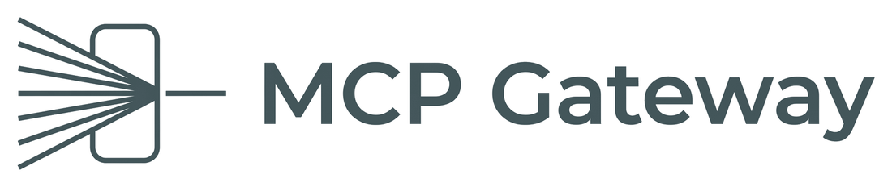

<p align="center">
  
</p>

<p align="center">
  One local daemon in front of all your MCP servers — curated toolsets, allow/deny policy, and an audit log.
</p>

<p align="center">
  
  
  
</p>

---

Every MCP client keeps its own list of servers, its own copy of your credentials, and its own
spawned subprocesses. Open three clients and you have three GitHub servers running, three
copies of the same config to maintain, and 120 tools competing for space in the model's
context — with no record of which one ran, or with what arguments.

MCP Gateway is a single local daemon that sits in front of all of them. It owns the backend
connections once and exposes curated subsets of their tools as named **profiles**. Clients
connect to `http://127.0.0.1:8420/mcp/<profile>` instead of spawning anything.

```
  github ──┐
  linear ──┼──► MCP Gateway ──► Claude Code · Claude Desktop · Cursor
  fs ──────┤     127.0.0.1:8420
  slack ───┘     policy · limits · audit
```

## Why

- **One config, not four.** Add a server once. Every client sees it.
- **One process per backend.** Three clients connected still means one GitHub subprocess.
- **Fewer, better tools.** Expose 12 relevant tools instead of 120, renamed to whatever reads
  clearly to the model.
- **Nothing runs unlogged.** Every call — allowed, denied, or failed — is one line of JSON.
- **Real brakes.** A denied tool is invisible *and* uncallable. Rate limits are per profile.
- **Tools can't change under you.** Descriptions are hashed and pinned; a server that quietly
  rewrites one gets blocked until you review the diff.

## Requirements

Node 20.11 or newer. Nothing else — no database, no Redis, no external services. Three runtime
dependencies: the MCP SDK, `yaml`, and `zod`.

## Install

Not published to npm. Build it from the repository:

```bash
npm install && npm run build
```

That produces `dist/src/cli.js` (`mcpgw`) and `dist/src/bridge.js` (`mcpgw-bridge`). Link them
onto your `PATH` with `npm link` if you want the bare command names.

## Configure

Create `config.yaml`. Declare your servers once, then compose profiles from them:

```yaml
version: 1

listen:
  host: 127.0.0.1
  port: 8420

servers:
  github:
    transport: stdio
    command: npx
    args: ["-y", "@modelcontextprotocol/server-github"]
    env:
      GITHUB_PERSONAL_ACCESS_TOKEN: ${GITHUB_TOKEN}

  fs:
    transport: stdio
    command: npx
    args: ["-y", "@modelcontextprotocol/server-filesystem", "~/code"]

  linear:
    transport: http
    url: https://mcp.linear.app/mcp
    headers:
      Authorization: Bearer ${LINEAR_KEY}

profiles:
  default:
    servers: ["*"]

  readonly:
    servers: [github, linear]
    allow: ["github__get_*", "github__list_*", "linear__list_*"]

  coding:
    servers: [github, fs]
    deny: ["github__delete_*", "github__merge_pull_request"]
    rename:
      github__create_issue: file_bug
    limits: { rpm: 60, concurrent: 4 }
```

Credentials come from environment variables via `${VAR}` — they never live in the config file.

Then start it:

```bash
mcpgw start
```

## Connect your clients

Give each client the profile that fits it — `coding` for your editor, `readonly` for anything
you trust less. Every entry below *replaces* that client's direct server entries; nothing but
the gateway should be spawning backends any more.

**Claude Code** (`~/.claude.json`) speaks HTTP, so it points straight at a profile:

```json
{ "mcpServers": { "gateway": { "type": "http", "url": "http://127.0.0.1:8420/mcp/coding" } } }
```

**Claude Desktop** (`%APPDATA%/Claude/claude_desktop_config.json`, or
`~/Library/Application Support/Claude/` on macOS) speaks only stdio, so it launches the bridge —
a shim that pipes stdin/stdout to the daemon and spawns no backends of its own:

```json
{
  "mcpServers": {
    "gateway": {
      "command": "node",
      "args": ["/abs/path/to/mcp-gateway/dist/src/bridge.js",
               "--url", "http://127.0.0.1:8420/mcp/readonly"]
    }
  }
}
```

**Cursor** (`~/.cursor/mcp.json`) uses the same bridge, usually on a different profile:

```json
{
  "mcpServers": {
    "gateway": {
      "command": "node",
      "args": ["/abs/path/to/mcp-gateway/dist/src/bridge.js",
               "--url", "http://127.0.0.1:8420/mcp/coding"]
    }
  }
}
```

If the daemon is not running, the bridge exits immediately with a readable message instead of
hanging on the first tool call.

## CLI

| Command | What it does |
|---------|--------------|
| `mcpgw start` | Run the daemon |
| `mcpgw validate` | Check the config without starting; exits non-zero on any error |
| `mcpgw status` | Backend health, uptime, restart counts, active sessions, pending drift |
| `mcpgw list --profile coding` | Every tool the profile exposes, plus the rule behind each decision |
| `mcpgw pin` | Show changed tool descriptions as diffs; `--yes` accepts them |
| `mcpgw tail --denied-only` | Stream the audit log |

`mcpgw list` is the one to reach for when a tool isn't showing up — it prints the decision and
the exact rule that produced it.

`SIGHUP` reloads the config, restarting only the servers whose definitions actually changed —
live sessions keep working, and a new allow list applies to them without a reconnect. A bad edit
is rejected and the previous config keeps serving. `SIGTERM`/`SIGINT` stop accepting new work,
give in-flight calls up to 5 seconds to finish, then shut the backends down.

## Policy

A profile picks servers, then filters their tools with globs. **Deny always beats allow**, and
if an `allow` list is present, anything not matching it is excluded. Filtering applies to both
listing and calling — a tool the model never saw is still refused if it guesses the name.

Tools are namespaced `<server>__<tool>` so two servers can both have a `search` without
colliding. Globs always match the canonical name, never the alias, so renaming can never be
used to slip past a deny rule.

## Audit log

One JSON object per line, in `audit/YYYY-MM-DD.jsonl`:

```json
{"ts":"2026-08-31T10:12:44.812Z","session":"s_7f3a91","profile":"coding",
 "client":{"name":"claude-code","version":"2.1.0"},"method":"tools/call",
 "server":"github","tool":"create_issue","exposed_as":"file_bug",
 "decision":"allow","args_hash":"sha256:7ab1…","dur_ms":412,"status":"ok"}
```

Plain JSONL, so `jq` is the query engine:

```bash
jq 'select(.decision != "allow")' audit/*.jsonl
```

Arguments are hashed by default. Set `log_args: full` to record them, or `none` to record
nothing — either way, configured regex patterns are redacted before anything is written.

## Tool pinning

The first time a tool is seen, `sha256(name + description + inputSchema)` goes into
`tools.lock.json`. Every startup and every `tools/list_changed` re-checks it. If a server
rewrites a tool description after you approved it, the tool is blocked, the change is logged,
and a diff is printed. `mcpgw pin` is the only way to accept it.

Commit `tools.lock.json`.

## Known limits

Deliberate, and each one is marked in the code:

- **Reverse requests need an idle backend.** A backend asking the client to sample is routed to
  the session whose call it arrived during. With two calls in flight on one backend, the second
  gets `-32006` rather than a guess — guessing would leak one client's prompt to another.
- **Rate limits are in memory.** Restarting the daemon resets them.
- **Audit writes are best-effort.** A hard crash can lose the last few lines.
- **`tools/list` pagination is collapsed** into a single page.
- **Resources and prompts are not proxied yet.** Tools only.

## Security

There is no client authentication, by design. The trust boundary is the local machine.

That only holds if the daemon stays local, so the gateway **refuses to bind a non-loopback
address** unless you explicitly set `listen.token`. Reaching the port means inheriting every
credential the gateway holds — the interlock is enforced at startup, not left to convention.

## Logo

Lines fan in from the left and converge to a single point inside a rounded gate, leaving as one
line on the right. Many backends in, one governed path out — and the gate is the only way
through.


| File | Use |
|------|-----|
| [`assets/logo.png`](assets/logo.png) | Horizontal lockup, mark plus wordmark. README and documentation headers |
| [`assets/icon.png`](assets/icon.png) | Square mark on its own. Favicon, app icon, social card |

Both are transparent PNGs in slate `#34494D`, which holds up on light and dark backgrounds
alike.

## License

MIT
