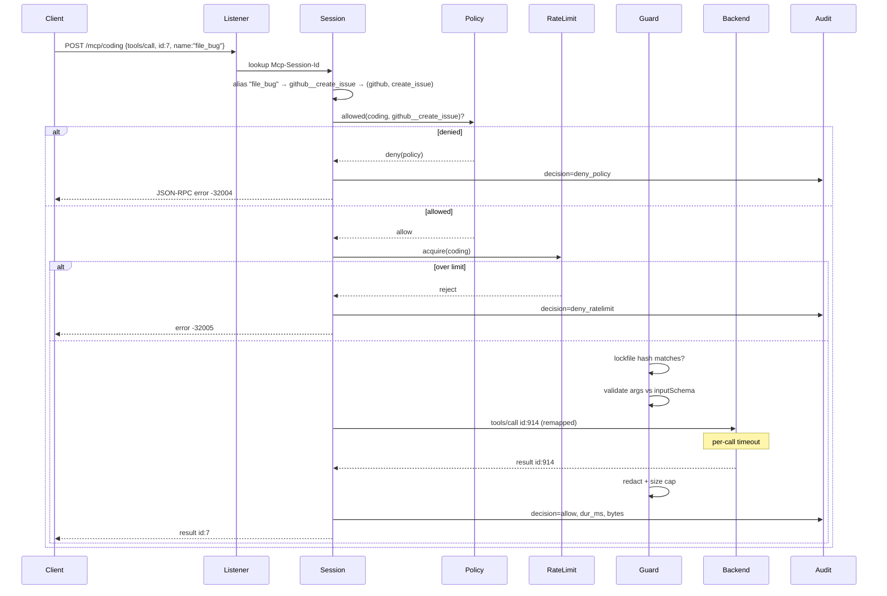

# MCP Gateway — Architecture

Companion to [PRD.md](./PRD.md) and [SPEC.md](./SPEC.md). This document covers structure,
flow, and the reasoning behind each choice. Exact schemas live in SPEC.md.

---

## 1. Topology

```
┌───────────────┐  ┌───────────────┐  ┌───────────────┐
│  Claude Code  │  │ Claude Desktop│  │    Cursor     │
└───────┬───────┘  └───────┬───────┘  └───────┬───────┘
        │ HTTP             │ stdio            │ stdio
        │                  ▼                  ▼
        │          ┌──────────────┐   ┌──────────────┐
        │          │ mcpgw-bridge │   │ mcpgw-bridge │   ~40 LOC, stateless
        │          └──────┬───────┘   └──────┬───────┘
        │                 │ HTTP             │ HTTP
        ▼                 ▼                  ▼
╔═══════════════════════════════════════════════════════════╗
║  GATEWAY DAEMON            127.0.0.1:8420   (one process)  ║
║                                                            ║
║   HTTP listener  ──►  /mcp/<profile>                       ║
║        │                                                   ║
║        ▼                                                   ║
║   Session Manager  ── Mcp-Session-Id ──► Session            ║
║        │                                                   ║
║        ▼                                                   ║
║   ┌────────────── Request Pipeline ──────────────┐          ║
║   │ resolve → policy → ratelimit → guard →       │          ║
║   │ dispatch → filter → audit                    │          ║
║   └───────────────────┬──────────────────────────┘          ║
║                       ▼                                     ║
║   Backend Pool  (one connection per server, shared)         ║
║        │              │                │                    ║
╚════════┼══════════════┼════════════════┼════════════════════╝
         │ stdio        │ stdio          │ HTTP
         ▼              ▼                ▼
   ┌───────────┐  ┌───────────┐   ┌──────────────┐
   │  github   │  │ filesystem│   │ linear (SaaS)│
   │ (child pr)│  │ (child pr)│   │              │
   └───────────┘  └───────────┘   └──────────────┘

Side files:  config.yaml (you)   tools.lock.json (generated)   audit/*.jsonl (append-only)
```

Two facts define everything else:

1. **Backends are shared, sessions are not.** One `github` subprocess serves every client.
   All fan-out/fan-in complexity concentrates in the Backend Pool.
2. **The gateway is a full MCP server *and* a full MCP client simultaneously.** It terminates
   the client protocol and originates a separate one downstream. Nothing is byte-forwarded.

## 2. Components

| Component | Responsibility | Does NOT |
|-----------|----------------|----------|
| **HTTP listener** | Bind, enforce loopback interlock, parse `/mcp/<profile>`, hand raw req/res to the SDK transport | Interpret MCP |
| **Session Manager** | Create/lookup/expire sessions by `Mcp-Session-Id`; hold per-session state (profile, client info, capabilities, in-flight map, progress tokens) | Talk to backends |
| **Catalog** | The merged, namespaced view of every backend's tools/resources/prompts; rebuilt on connect and on `list_changed` | Enforce policy |
| **Policy engine** | Given (profile, tool) → `allow` \| `deny(reason)`. Pure function over config. Same answer for `list` and `call` | Know about HTTP or sessions |
| **Rate limiter** | Per-profile token bucket (rpm) + concurrency semaphore | Persist across restart |
| **Guard** | Pin/verify tool hashes, redact secrets, cap result size | Inspect semantics |
| **Backend Pool** | Own one connection per configured server; supervise stdio children; reconnect with backoff; route requests and correlate replies | Filter |
| **Audit writer** | Serialise one JSON line per request, rotate by date, never block the request path | Query |
| **CLI** | `start`, `status`, `pin`, `tail`, `validate` | Serve traffic |

Dependency direction is strictly downward: listener → session → pipeline → pool. The Policy
engine and Guard are pure and unit-testable in isolation; that is deliberate, they hold the
rules you most need to be right.

## 3. Request lifecycle

### 3.1 `tools/call` — the hot path



**Critical detail — ID remapping.** Client ids and backend ids live in different JSON-RPC
spaces. Two clients will both send `id: 1`. The gateway allocates a fresh monotonic id per
backend request and keeps `backendId → {session, clientId, startedAt, timer}`. Every reply,
error, timeout, and cancellation resolves through that map. Getting this wrong is the number
one way a gateway delivers one client's result to another; it is the single most important
invariant in the codebase.

### 3.2 Server-initiated requests (reverse direction)

Backends may send `sampling/createMessage`, `elicitation/create`, or `roots/list` *to the
client*. With a shared backend, "the client" is ambiguous.

Rule: a reverse request is routed to the session that owns the in-flight call it arrives
during, matched by the backend's `_meta.relatedRequestId` when present, otherwise by the
backend's single outstanding request. If neither resolves — an unsolicited reverse request
with nothing in flight — the gateway replies with an error, logs it, and does **not** guess.
Guessing here would leak one client's prompt to another.

Consequence: the gateway advertises `sampling`/`elicitation` capability to a backend only if
*every* session currently attached could service it. In practice v1 advertises them
optimistically and errors on the rare unroutable case; simpler, and the failure is visible.

### 3.3 Notifications (fan-out)

`notifications/tools/list_changed` from `github` →

1. Backend Pool re-runs `tools/list` on that backend.
2. Guard re-hashes; any changed tool is marked drifted and (default) blocked.
3. Catalog rebuilds the `github__*` namespace.
4. Every session whose profile includes `github` **and** whose visible tool set actually
   changed receives `notifications/tools/list_changed`. Sessions whose filtered view is
   unaffected are not woken — otherwise a chatty backend spams every client.

`notifications/progress` is routed via the progress-token map, rewritten per session so
tokens from different clients never collide.

### 3.4 Startup

```
parse args → load config.yaml → interpolate ${ENV} → validate (zod)
  → assert loopback-or-token (NFR-2)
  → bind listener IMMEDIATELY          ← serving before backends are ready
  → connect all backends in parallel, each with its own timeout
       ├─ stdio: spawn child, handshake, tools/list
       └─ http:  initialize, tools/list
  → load tools.lock.json, diff, mark drift
  → build catalog per profile
```

The listener binds before backends connect. A client attaching early gets a valid session and
a `tools/list` reflecting whatever is ready, plus a `list_changed` as the rest arrive. This is
what buys NFR-6 — a slow `npx` cold-start never delays the port.

### 3.5 Backend failure

```
child exits / http conn drops
  → mark server DOWN, fail all in-flight with -32003, clear id map
  → its tools disappear from catalogs → list_changed to affected sessions
  → reconnect after backoff (1s, 2s, 4s, 8s, capped, max_retries)
  → on success: re-handshake, re-list, re-verify hashes, restore catalog
  → on exhaustion: stay DOWN, surface in `mcpgw status`, keep serving everything else
```

A DOWN backend never blocks the daemon or its peers (NFR-5). Calls to its tools return a
clear error naming the server, not a hang.

## 4. State

Everything is in-memory except three files. There is no database.

| State | Where | Survives restart |
|-------|-------|------------------|
| Config | `config.yaml`, you author it | yes |
| Tool pins | `tools.lock.json`, generated, commit it | yes |
| Audit | `audit/YYYY-MM-DD.jsonl`, append-only | yes |
| Sessions, id maps, catalogs, rate buckets, backend handles | RAM | no |

Losing in-memory state on restart is correct: clients reconnect and re-initialize, which MCP
already handles. Persisting sessions would be complexity bought for nothing.

## 5. Concurrency

Single-threaded Node event loop. Every path is async I/O — no CPU-bound work except hashing a
few kilobytes on startup. Guards against the ways that breaks:

- **Head-of-line blocking:** each backend request is independent; nothing awaits a queue.
- **Unbounded in-flight:** per-profile concurrency semaphore plus a global cap.
- **Slow backends:** every backend request carries a timeout; on fire, the id-map entry is
  released and the client gets an error.
- **Audit writes:** appended through a stream, never awaited on the request path. Audit
  durability is deliberately best-effort — this is a personal tool, not a compliance system.

No worker threads, no clustering. If throughput ever matters, the fix is multiple daemons on
different ports with different configs, not shared-state scaling.

## 6. Security model

The trust boundary is **the local machine**. That single sentence is the whole model, and it is
only true if the interlock in NFR-2 holds — hence it is enforced in code at bind time, not left
to documentation.

| Threat | Handling |
|--------|----------|
| Silent tool-description mutation (rug-pull) | Lockfile hashes; block on drift (FR-13/14) |
| Injected instructions inside tool descriptions | Partially: change detection only. Content scanning deferred |
| Overbroad tool exposure | Profiles: allow/deny enforced on list *and* call |
| Credential leakage into logs | Env-var-only secrets, regex redaction, error scrubbing |
| Runaway/looping agent | Per-profile rpm + concurrency caps |
| Oversized/hostile payloads | Result size cap, JSON body limit |
| Remote access to an unauthenticated daemon | Loopback-only bind, enforced at startup |

Non-goals: an attacker with local shell access already has your env vars and can call the
backends directly. Defending that would require auth, which is explicitly out of scope.

## 7. Tech stack

| Layer | Choice | Why this and not the obvious alternative |
|-------|--------|------------------------------------------|
| Runtime | Node 24+ (LTS), TypeScript, ESM | Official MCP SDK is best-maintained here and the work is pure I/O — Go's concurrency edge would not pay for re-implementing the protocol |
| Protocol | `@modelcontextprotocol/sdk` | Both server and client sides, all three transports, session handling. Hand-rolling JSON-RPC framing is the classic own-goal |
| HTTP | `node:http` | The SDK transport takes raw `req`/`res`. Express would add a dependency to route three paths |
| Config | `yaml` | Only real dep here |
| Validation | `zod` | Already a transitive dep of the SDK. Free |
| Storage | Plain files | No DB. `jq` over JSONL answers every question v1 has |
| Rate limit | ~15 lines, in-memory token bucket | A library for one bucket per profile is not a library |
| CLI parsing | `node:util` `parseArgs` | stdlib |
| Tests | `node:test` + `node:assert` | stdlib |
| Logging | JSON lines to stderr | stdlib |

Runtime dependency count: **3** (`@modelcontextprotocol/sdk`, `yaml`, `zod`).

## 8. Files

```
mcp-gateway/
├─ config.yaml                  # yours
├─ tools.lock.json              # generated, commit it
├─ audit/YYYY-MM-DD.jsonl       # gitignored
├─ docs/{PRD,ARCHITECTURE,SPEC,ROADMAP}.md
└─ src/
   ├─ cli.ts                    # parseArgs → start|status|pin|tail|validate
   ├─ config.ts                 # load, ${ENV} interpolate, zod validate
   ├─ server.ts                 # node:http listener, loopback interlock, /mcp/<profile>
   ├─ session.ts                # session lifecycle, id remap, progress tokens
   ├─ pipeline.ts               # resolve → policy → limit → guard → dispatch → audit
   ├─ policy.ts                 # pure: (profile, tool) → decision
   ├─ catalog.ts                # namespacing, merge, per-profile views
   ├─ ratelimit.ts              # token bucket + semaphore
   ├─ guard.ts                  # hashing, lockfile, redaction, size caps
   ├─ backend.ts                # one backend: connect, supervise, backoff, call
   ├─ pool.ts                   # all backends, fan-out notifications
   ├─ audit.ts                  # JSONL append + rotation
   └─ bridge.ts                 # stdio ⇄ HTTP shim binary
```

Thirteen files, one concern each. `policy.ts` and `guard.ts` are pure and get real tests;
the rest are I/O wiring.

## 9. Decisions taken, and what was rejected

| Decision | Rejected alternative | Reason |
|----------|---------------------|--------|
| One shared connection per backend | Connection per session | Defeats P2, the main point of the gateway |
| No database | Postgres + Redis | Single process, single user. A DB is an operational burden buying nothing |
| JSONL audit | SQLite | `jq` is the query engine. Revisit when it stops answering questions |
| Full protocol termination | Transparent byte-forwarding | You cannot filter, rename, or audit what you do not parse |
| Config file + SIGHUP | Runtime admin API | No UI, no second user. An API would be its own attack surface with no auth to protect it |
| Namespace `server__tool` | Bare names with collision resolution | Deterministic, debuggable, obvious in the audit log |
| Bind before backends connect | Wait for readiness | 8 `npx` cold starts would blow the 3 s budget |
| Deny beats allow, fail closed | Permissive default | The only safe default for a policy engine |
| In-memory rate limits | Persisted counters | Restarting the daemon resetting your own limits is fine |
